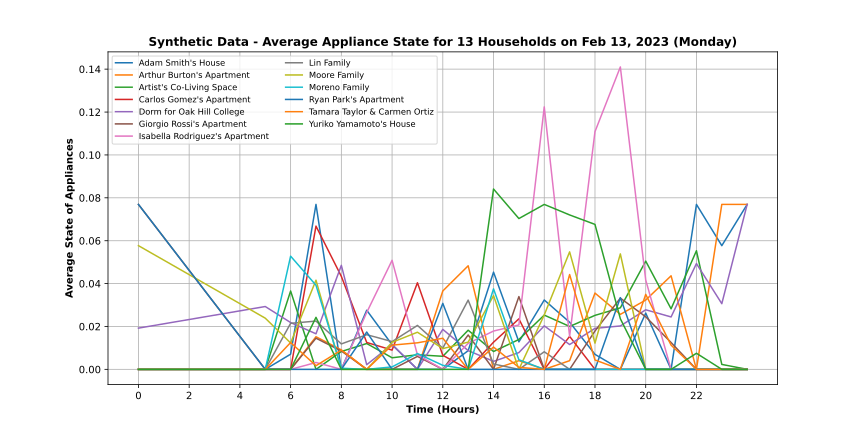

# Scaling Up Private LLM Agents to Synthesize Household Energy Consumption Data


<p align="center" width="100%">

</p>

This repository contains the work of Phoebe (Thi Ngan Dang), a vacation intern from CSIRO/Pawsey, on ["Scaling Up Private LLM Agents to Synthesize Household Energy Consumption Data"](Phoebe_Dang-poster.pdf)  This repo revolves around the LLM agent simulation, [Simulacra](https://arxiv.org/abs/2304.03442), with the implementation of using LocalLLM on Supercomputer Setonix. The daily household energy consumption has been plotted based on the simulation results. Below, we document the steps for setting up the simulation environment in Setonix and replicating the plots presented in the paper.

This repo is based on the work of:
- The original repo: https://github.com/joonspk-research/generative_agents
- Yusuke's work on the transition to LocalLLM: https://github.com/csiro-energy-systems/generative_agents_localLLM

##    Login into Sentonix and set up the Github repo
See [Running LLMs on Pawse](<Running LLMs on Pawsey - Update 01-2025.docx>)on how to log in Setonix using ssh and set up vscode (recommended)

```
# Once logged in, go to scratch
cd $MYSCRATCH
# clone the repository (use SSH clone if this does not work)
git clone this-repo.git
cd  this-repo-url
```

##    Setting Up the Environment 
To set up your environment, you will need to modify the `utils.py` file that contains your hf_hey token and the open-source model you would like to use for text embedding and text generations.

### Step 1. Generate Utils File
In the `reverie/backend_server` folder (where `reverie.py` is located), look for a file titled `utils.py`. Please paste your huggingface token in `hf_hey` You can also change the embedding and LLM models by `embedding_checkpoint` and `checkpoint` respectively 
```
# change this to your key
hf_hey = "" 

embedding_checkpoint = "jinaai/jina-embeddings-v2-base-en"

# change this to your desired model
checkpoint = "mistralai/Mistral-7B-Instruct-v0.1"  
```

### Step 2. Install requirements.txt
Install everything listed in the `requirements.txt` file (I strongly recommend first setting up a virtualenv as usual). A note on Python version: we tested our environment on Python 3.9.12. 
```
# set up environment
cd $MYSOFTWARE
# copy `requirements.txt` file into MYSOFTWARE
cp <path-to-requirements.txt-file> $MYSOFTWARE
# check latest version
module avail pytorch
# load pytorch (replace with latest version)
module load pytorch/2.2.0-rocm5.7.3  
# check list
module list
# create python environment
bash
python3 -m venv --system-site-packages YOUR_ENV_NAME
source YOUR_ENV_NAME/bin/activate
python3 -m pip install -r requirements.txt
exit
```

##    Running a Simulation 
To run a new simulation, you will need to concurrently start two servers: the environment server and the agent simulation server.

### Step 1. Starting the Environment Server
Again, the environment is implemented as a Django project, and as such, you will need to start the Django server. To do this, first navigate to `environment/frontend_server` (this is where `manage.py` is located) in your command line. The Web server must be run on Singularity. Run the following command:
```
# activate the environment on Singularity. If you have done this, skip to next steps
cd $MYSOFTWARE
# check latest version
module avail pytorch
# load pytorch (replace with latest version)
module load pytorch/2.2.0-rocm5.7.3  
# check list
module list
# activate python environment
bash
source YOUR_ENV_NAME/bin/activate

# navigate to `environment/frontend_server` 
    cd $MYSCRATCH/<your-path>/environment/frontend_server/
    python manage.py runserver
# a pop up window will appear, click open in browser
```
Then, you will be navigated to a browser. If you see a message that says, "Your environment server is up and running," your server is running properly. Ensure that the environment server continues to run while you are running the simulation, so keep this command-line tab open! (Note: I recommend using either Chrome or Safari. Firefox might produce some frontend glitches, although it should not interfere with the actual simulation.)

### Step 2. Starting the Simulation Server
Open up another command line (the one you used in Step 1 should still be running the environment server, so leave that as it is). 
Open run_backend.sh or create a new bash script with the below script:

```
#!/bin/bash --login  

#SBATCH --job-name=backend_server  # Name the job
#SBATCH --account=interns202410-gpu  # Use your own project and the -gpu suffix
#SBATCH --partition=gpu  # Ensure partition is gpu
#SBATCH --nodes=1  # 1 node 
#SBATCH --gpus-per-node=8  # 1 GPU per node # change this to the number of GPUs you want to use
#SBATCH --time=24:00:00  # Set time needed

# --------------------------
# Load the needed modules
module load pytorch/2.2.0-rocm5.7.3 
module list


# --------------------------
# Some paths - Modify these paths to match your environment
VENV_PATH=$MYSOFTWARE/appenv/bin/activate
PYTHON_SCRIPT=$MYSCRATCH/updated_gen_LLM/reverie/backend_server/reverie.py

export HF_HOME=$MYSCRATCH/hf_cache
echo "HF_HOME set to $HF_HOME"

# --------------------------
# Run the django application
cd $MYSCRATCH/updated_gen_LLM/reverie/backend_server

# Record the start time
start_time=$(date +%s)
echo "start time: $(date -d @$start_time)"

# run for a day
echo "Running the backend server: srun -N 1 -n 1 -c 8 --gres=gpu:8 bash -c 
  source $VENV_PATH && 
  pip list && 
  python $PYTHON_SCRIPT --forked_simulation simulation_base_the_ville_n25_30s  \
                  --new_simulation simulation_base_the_ville_n25_30s_run1_12h \
                  --option 'run 1440'       "

# change the gpu:8 to the number of GPUs you want to use
# change forked_simulation to the name of base simulation you want to fork
# change new_simulation to the unique name of the simulation you want to create to avoid File exists error
# modify the option to run for the desired number of steps
# 30 seconds per step. 24 hours =  2,880 steps
srun -N 1 -n 1 -c 8 --gres=gpu:8 bash -c "
  source $VENV_PATH && \
  pip list && \
  python $PYTHON_SCRIPT --forked_simulation simulation_base_the_ville_n25_30s  \
                  --new_simulation simulation_base_the_ville_n25_30s_run1_12h \
                  --option 'run 1440' 
" 

# Record the end time
end_time=$(date +%s)
echo "End time: $(date -d @$end_time)"

# Calculate and display the duration
duration=$((end_time - start_time))
# Convert duration to hours, minutes, and seconds
hours=$((duration / 3600))
minutes=$(((duration % 3600) / 60))
seconds=$((duration % 60))
echo "*****************************************************"
echo "Job completed in $hours hours, $minutes minutes, and $seconds seconds."
echo "*****************************************************"

```
Change the script if needed following the comments

Run the script (a slurm job)
```
cd $MYSCRATCH
sbatch run_backend.sh 
# you can use this cmd to check the progress of the job
squeue --me
# see job output, looking for slurm-jobid.out
```

### Notes and Tips for Customisation:
- To custom the meta data for a simulation, go to [forked_simulation](environment/frontend_server/storage) / forked_simulation name/reverie/meta.json
  "start_date": "February 13, 2023",
  "curr_time": "February 13, 2023, 00:00:00",
  "sec_per_step": 30, (seconds)
- For the time interval `<sec_per_step>`, setting it to 60s will generate large time gaps. I would recommend setting it at 10s (best option), or at least 30s for data consistency.
- Note that you will want to replace --option 'run `<step-count>`'  above with an integer indicating the number of game steps you want to simulate. For instance, if you want to simulate 100 game steps, you should input `run 100`. One game step represents `<sec_per_step>` seconds in the game.
- The saved simulation can be accessed the next time you run the simulation server by providing the name of your simulation as the forked simulation. This will allow you to restart your simulation from the point where you left off.

### Step 3. Running and Saving the Simulation
On your browser, navigate to http://localhost:<your-port>/simulator_home. You should see the map of Smallville, along with a list of active agents on the map. You can move around the map using your keyboard arrows. 

#For Replaying and Demo of the simulation, please to refer to the original Simulacra repo

### Tips
- As mentioned in Simulacra, you will need a model equivalent to or stronger than ChatGPT3.5-Turbo for the agents to behave more like humans.
- Ensure that the tab of your frontend environment is always open and active. Otherwise, the frontend will not communicate with the backend, leading to the simulation stalling. A similar issue is documented in this GitHub issue https://github.com/joonspk-research/generative_agents/issues/93 
- If you encounter the message "Please start the backend first," after running the slurm job:
check the job output to see if there are any errors or if it is running yet. If everything is fine, just wait a few minutes for the new_simulation to be created. Reload the webpage, and your issue should be fixed. 

##    Simulation Storage Location
All simulations that you save will be located in `environment/frontend_server/storage`, and all compressed demos will be located in `environment/frontend_server/compressed_storage`. 

## Customisation
For Customisation of the simulation, Please refer to the original repo https://github.com/joonspk-research/generative_agents


## ⚡ Plotting Daily Energy Consumption
All the files related to energy consumption extraction can be found in `reverie/energy`
Similarly, the downloaded folder `compressed_storage` can also be found in the shared folder in the MSteams project "Safe Synthetic Data with GenAI"

### Plot synthetic data from simulaton
Navigate to `reverie/energy` 

#### 1. Compress the data and extracting appliances from the simulation result
Run python pipeline.py. Change the time interval in energy_calc_string_match.py if needed. The pipeline for generating the time series plot consists of:

1. Compressing the simulation result in `environment/frontend_server/storage` and saving it into `environment/frontend_server/compressed_storage`
2. Extracting appliances from the simulation result. During this process, the artifact `energy_output_simulation_base_the_ville_n25_30s_run2_1day.csv` is generated, which can be inspected for debugging purposes.

#### 2. Plot the time series from `energy_output_simulation_base_the_ville_n25_30s_run2_1day.csv`, which contains timestamps and values.
Run the jupiter notebook plot.ipynb. Ensure that the files containing the simulation result are properly set 



## ❤️ Acknowledgement
I would like to thank following people for their support and supervisions in this project. 

Supervisors: Mahathir Almoshor

Teammates: Jasmine Huynh

Managers: Fathima Haseen, Victor Olet, Aditya Pribadi Kalapaaking

CSIRO and Pawsey for the vacation internship program as well as compute resources provided

## References and related Documents
- The original repo: https://github.com/joonspk-research/generative_agents
- Yusuke's work on the transition to LocalLLM: https://github.com/csiro-energy-systems/generative_agents_localLLM
- [Running LLMs on Pawsey](<Running LLMs on Pawsey - Update 01-2025.docx>)
- Run a private llm on setonix: https://github.com/csiro-energy-systems/private_llm_on_setonix
- Port forwarding for web server: https://github.com/Phoebedang926/Port_forwarding_Setonix