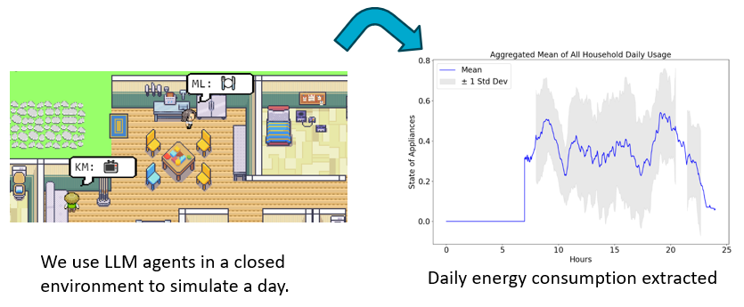
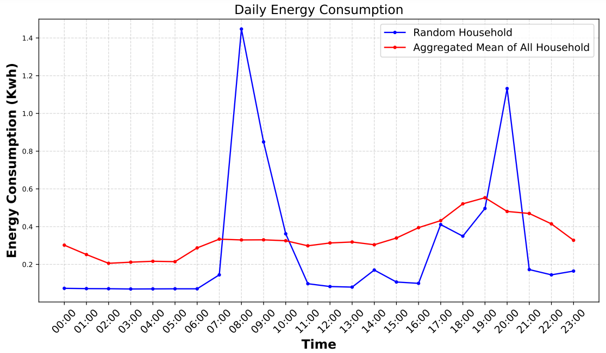
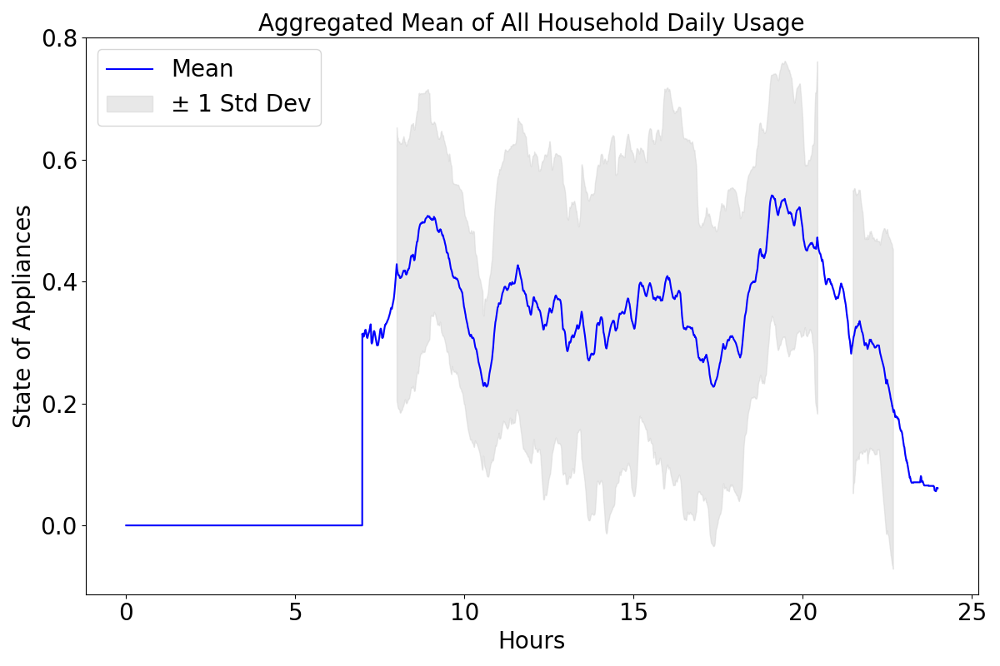

# Can Private LLM Agents Synthesize Household Energy Consumption Data?

<p align="center" width="100%">

</p>

This repository contains the work of Yusuke Miyashita, a vacation intern from CSIRO/Pawsey, on ["Can Private LLM Agents Synthesize Household Energy Consumption Data?"](Yusuke_interns_presentation.pptx)  This paper revolves around the LLM agent simulation, [Simulacra](https://arxiv.org/abs/2304.03442), with the implementation of using LocalLLM. The daily household energy consumption has been plotted based on the simulation results. Below, we document the steps for setting up the simulation environment and replicating the plots presented in the paper.


The simulation setup is almost identical to that of the original paper on Simulacra, with modifications made in `reverie/backend_server/utils.py`, `reverie/backend_server/persona/prompt_template/gpt_structure.py`, and `reverie/backend_server/persona/prompt_template/run_gpt_prompt.py`.

The transition to LocalLLM is implemented in the same manner as described in https://github.com/joonspk-research/generative_agents/issues/1.

##    Setting Up the Environment 
To set up your environment, you will need to generate a `utils.py` file that contains your hf_hey token and the open-source model you would like to use for text embedding and text generations.

### Step 1. Generate Utils File
In the `reverie/backend_server` folder (where `reverie.py` is located), create a new file titled `utils.py` and copy and paste the content below into the file:
```
# Ignore this OpenAI API part as this is not necessary for LocalLLM
openai_api_key = "" # keep this empty as we use LocalLLM
# Put your name
key_owner = "" # keep this empty

# huggingface key to load localLLM
from huggingface_hub import login
hf_hey = ""
login(hf_hey)

embedding_checkpoint = "jinaai/jina-embeddings-v2-base-en"

# declare model here so function do not have to call this part everytime
import os
import torch

import torch
# Set the desired GPU device index (0, 1, 2, etc.)
desired_gpu_index = 0
# Set the CUDA_VISIBLE_DEVICES environment variable
os.environ["CUDA_VISIBLE_DEVICES"] = str(desired_gpu_index)

device = "cuda" if torch.cuda.is_available() else "cpu"

from transformers import AutoTokenizer, AutoModelForCausalLM, BitsAndBytesConfig

torch.cuda.empty_cache()
def set_cuda_alloc_conf(max_split_size_mb):
    os.environ['PYTORCH_CUDA_ALLOC_CONF'] = f'max_split_size_mb:{max_split_size_mb},{max_split_size_mb},{max_split_size_mb}'

# Check if the key exists before deleting it
if 'PYTORCH_CUDA_ALLOC_CONF' in os.environ:
    del os.environ['PYTORCH_CUDA_ALLOC_CONF']

# mixtral
checkpoint = "mistralai/Mistral-7B-Instruct-v0.1"  
#checkpoint = "mistralai/Mixtral-8x7B-Instruct-v0.1"
#checkpoint = "meta-llama/Llama-2-13b-chat-hf"
model = AutoModelForCausalLM.from_pretrained(checkpoint, trust_remote_code=True, torch_dtype=torch.bfloat16).to(device)#, device_map="auto") 


tokenizer = AutoTokenizer.from_pretrained(checkpoint)
tokenizer.pad_token_id = tokenizer.eos_token_id    # for open-ended generation


maze_assets_loc = "../../environment/frontend_server/static_dirs/assets"
env_matrix = f"{maze_assets_loc}/the_ville/matrix"
env_visuals = f"{maze_assets_loc}/the_ville/visuals"

fs_storage = "../../environment/frontend_server/storage"
fs_temp_storage = "../../environment/frontend_server/temp_storage"

collision_block_id = "32125"

# Verbose 
debug = True
```
 
### Step 2. Install requirements.txt
Install everything listed in the `requirements.txt` file (I strongly recommend first setting up a virtualenv as usual). A note on Python version: we tested our environment on Python 3.9.12. 

##    Running a Simulation 
To run a new simulation, you will need to concurrently start two servers: the environment server and the agent simulation server.

### Step 1. Starting the Environment Server
Again, the environment is implemented as a Django project, and as such, you will need to start the Django server. To do this, first navigate to `environment/frontend_server` (this is where `manage.py` is located) in your command line. Then run the following command:

    python manage.py runserver

Then, on your favorite browser, go to [http://localhost:8000/](http://localhost:8000/). If you see a message that says, "Your environment server is up and running," your server is running properly. Ensure that the environment server continues to run while you are running the simulation, so keep this command-line tab open! (Note: I recommend using either Chrome or Safari. Firefox might produce some frontend glitches, although it should not interfere with the actual simulation.)

### Step 2. Starting the Simulation Server
Open up another command line (the one you used in Step 1 should still be running the environment server, so leave that as it is). Navigate to `reverie/backend_server` and run `reverie.py`.

    python reverie.py
This will start the simulation server. A command-line prompt will appear, asking the following: "Enter the name of the forked simulation: ". To start a 3-agent simulation with Isabella Rodriguez, Maria Lopez, and Klaus Mueller, type the following:
    
    base_the_ville_isabella_maria_klaus
The prompt will then ask, "Enter the name of the new simulation: ". Type any name to denote your current simulation (e.g., just "test-simulation" will do for now).

    test-simulation
Keep the simulator server running. At this stage, it will display the following prompt: "Enter option: "

### Step 3. Running and Saving the Simulation
On your browser, navigate to [http://localhost:8000/simulator_home](http://localhost:8000/simulator_home). You should see the map of Smallville, along with a list of active agents on the map. You can move around the map using your keyboard arrows. Please keep this tab open. To run the simulation, type the following command in your simulation server in response to the prompt, "Enter option":

    run <step-count>
Note that you will want to replace `<step-count>` above with an integer indicating the number of game steps you want to simulate. For instance, if you want to simulate 100 game steps, you should input `run 100`. One game step represents 10 seconds in the game.


Your simulation should be running, and you will see the agents moving on the map in your browser. Once the simulation finishes running, the "Enter option" prompt will re-appear. At this point, you can simulate more steps by re-entering the run command with your desired game steps, exit the simulation without saving by typing `exit`, or save and exit by typing `fin`. If saving results in error, you can simply `ctl+c` to save what you can save. 

The saved simulation can be accessed the next time you run the simulation server by providing the name of your simulation as the forked simulation. This will allow you to restart your simulation from the point where you left off.

### Step 4. Replaying a Simulation
You can replay a simulation that you have already run simply by having your environment server running and navigating to the following address in your browser: `http://localhost:8000/replay/<simulation-name>/<starting-time-step>`. Please make sure to replace `<simulation-name>` with the name of the simulation you want to replay, and `<starting-time-step>` with the integer time-step from which you wish to start the replay.

For instance, by visiting the following link, you will initiate a pre-simulated example, starting at time-step 1:  
[http://localhost:8000/replay/July1_the_ville_isabella_maria_klaus-step-3-20/1/](http://localhost:8000/replay/July1_the_ville_isabella_maria_klaus-step-3-20/1/)

### Step 5. Demoing a Simulation
You may have noticed that all character sprites in the replay look identical. We would like to clarify that the replay function is primarily intended for debugging purposes and does not prioritize optimizing the size of the simulation folder or the visuals. To properly demonstrate a simulation with appropriate character sprites, you will need to compress the simulation first. To do this, open the `compress_sim_storage.py` file located in the `reverie` directory using a text editor. Then, execute the `compress` function with the name of the target simulation as its input. By doing so, the simulation file will be compressed, making it ready for demonstration.

To start the demo, go to the following address on your browser: `http://localhost:8000/demo/<simulation-name>/<starting-time-step>/<simulation-speed>`. Note that `<simulation-name>` and `<starting-time-step>` denote the same things as mentioned above. `<simulation-speed>` can be set to control the demo speed, where 1 is the slowest, and 5 is the fastest. For instance, visiting the following link will start a pre-simulated example, beginning at time-step 1, with a medium demo speed:  
[http://localhost:8000/demo/July1_the_ville_isabella_maria_klaus-step-3-20/1/3/](http://localhost:8000/demo/July1_the_ville_isabella_maria_klaus-step-3-20/1/3/)

### Tips
- As mentioned in Simulacra, you will need a model equivalent to or stronger than ChatGPT3.5-Turbo for the agents to behave more like humans.
- Ensure that the tab of your frontend environment is always open and active. Otherwise, the frontend will not communicate with the backend, leading to the simulation stalling. A similar issue is documented in this GitHub issue https://github.com/joonspk-research/generative_agents/issues/93 
- If you encounter the message "Please start the backend first," restart the frontend first with `python manage.py runserver`, then run the backend again with `python reveries.py`. Reload the webpage, and your issue should be fixed. A similar issue was reported in this GitHub issue. https://github.com/joonspk-research/generative_agents/issues/15

##    Simulation Storage Location
All simulations that you save will be located in `environment/frontend_server/storage`, and all compressed demos will be located in `environment/frontend_server/compressed_storage`. 

## Customisation
For Customisation of the simulation, Please refer to the original repo https://github.com/joonspk-research/generative_agents


## ⚡ Plotting Daily Energy Consumption
All the files related to energy consumption extraction can be found in `reverie/energy`
Similarly, the generated data simulation data from the experiment is stored in `C:\Users\miy012\generative_agents_localLLM\environment\frontend_server\compressed_storage` in Optimus


### Real Dataset
[Smart-Grid Smart-City Customer Trial Data](https://data.gov.au/dataset/ds-dga-4e21dea3-9b87-4610-94c7-15a8a77907ef/details)

For this experiment, the data has been downloaded in Optimus and the plot is generated on `reverie/backend_server/plots.ipynb`



### Plot synthetic data from simulaton
Navigate to `reverie/energy` and run `python pipeline.py`

The pipeline for generating the time series plot consists of:

1. Compressing the simulation result in `environment/frontend_server/storage` and saving it into `environment/frontend_server/compressed_storage`
2. Extracting appliances from the simulation result. During this process, the artifact `energy_output.csv` is generated, which can be inspected for debugging purposes.
3. Plotting the time series from `energy_output.csv`, which contains timestamps and values.

Ensure that the files containing the simulation result are properly set in `pipeline.py`



## ❤️ Acknowledgement
I would like to thank following people for their support and supervisions in this project. 

Supervisors: Mahathir Almoshor, Sam West

Teammates: Dai Dong, Imam Prakoso, Fiona Zhang

Managers: Emily Dioguardi, Aditya Pribadi Kalapaaking, Ann Backhous

CSIRO and Pawsey for the vacation internship program as well as compute resources provided

## Issue
### MultiGPU inference
Using the `accelerate` library and setting `device_map="auto"` when defining the model for multiGPU inference results in the error "RuntimeError: CUDA error: device-side assert triggered." This issue has been encountered with both "Vanilla VM" and "Optimus" setups. Many users seem to face this problem when running Large Language Models (LLMs) on multiGPU setups, regardless of the model size. Similar issues have been reported in:
https://github.com/huggingface/transformers/issues/22546

https://github.com/huggingface/transformers/issues/28463

The error occurs during inference, even though loading the model onto multiple GPUs proceeds without any problems.

The code snippet that generates the error is:

`model = AutoModelForCausalLM.from_pretrained(checkpoint, trust_remote_code=True, torch_dtype=torch.bfloat16, device_map="auto") `
